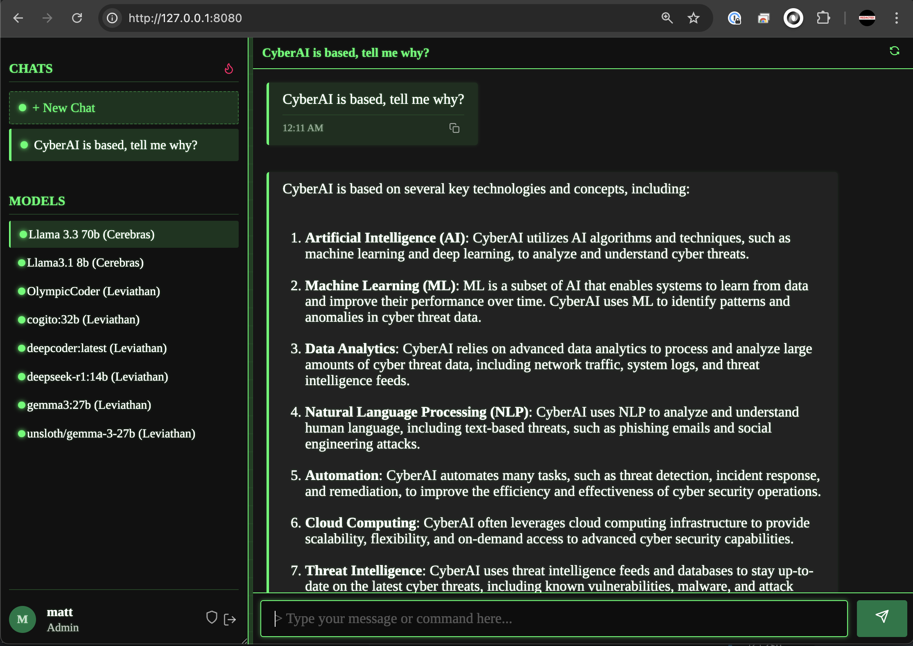
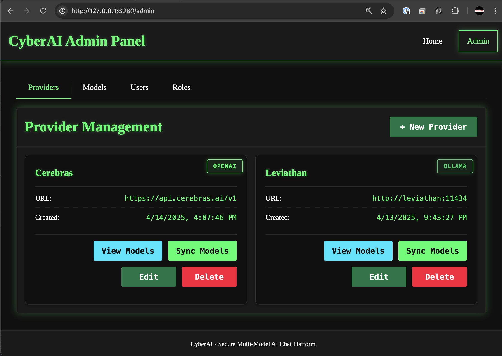

<div align="center">
<table>
  <tr>
    <td>
      
    </td>
    <td>
      
    </td>
  </tr>
</table>
</div>

<div align="center">
  <h1>CyberAI</h1>
  <p><strong>Secure Multi-Model AI Chat Platform</strong></p>
  <p>🤖 Multiple AI Models | 🌍 Web UI | ⚡ Real-time Streaming | 🔒 Secure | 🎨 Cyberpunk Terminal</p>
  <p>
    
    
    
    
  </p>
</div>

CyberAI is a powerful, secure multi-user chat platform that integrates multiple AI models through a cyberpunk-inspired terminal interface. Built with performance, security, and flexibility in mind, it provides a centralized interface for interacting with various language models.

> The intention is to provide a sleek, secure, and efficient way to interact with AI language models through a unified interface.

## 🌟 Features

<table>
  <tr>
    <th>Model Support</th>
    <th>Chat Features</th>
  </tr>
  <tr>
    <td>
      <ul>
        <li>Multiple LLM provider integration (Ollama, OpenAI)</li>
        <li>Custom agent system with specialized prompts</li>
        <li>Model enumeration system</li>
        <li>Per-user model access control</li>
        <li>Endpoint registration system</li>
        <li>Model discovery system</li>
      </ul>
    </td>
    <td>
      <ul>
        <li>Real-time message streaming</li>
        <li>Markdown rendering for responses</li>
        <li>Copy-to-clipboard functionality</li>
        <li>Chat history preservation</li>
        <li>Multi-user concurrent chat sessions</li>
        <li>Smooth scrolling interface</li>
      </ul>
    </td>
  </tr>
  <tr>
    <th>User Interface</th>
    <th>Security</th>
  </tr>
  <tr>
    <td>
      <ul>
        <li>Cyberpunk S3270 terminal-inspired design</li>
        <li>Responsive chat interface</li>
        <li>Dynamic model selection</li>
        <li>Admin dashboard for system management</li>
        <li>Agent creation/selection UI</li>
        <li>Metrics display component</li>
      </ul>
    </td>
    <td>
      <ul>
        <li>User authentication system</li>
        <li>Role-based access control</li>
        <li>Secure API endpoint storage</li>
        <li>Protected WebSocket connections</li>
        <li>Input sanitization</li>
        <li>Encrypted sensitive data</li>
      </ul>
    </td>
  </tr>
</table>

## 🚀 Quick Start

### Docker

```bash
docker run -d --name cyberai -p 8080:8080 rambrogers/cyberai:latest
```

Access the web interface:
- Web UI: http://localhost:8080

## 🔨 Building from Source

### Prerequisites

- Go 1.21 or later
- SQLite 3.35+

### Clone and Build

```bash
# Clone the repository
git clone https://github.com/rambrogers/cyberai.git
cd cyberai

# Build the application
go build -o cyberai ./cmd/cyberai

# Run the application
./cyberai
```

### Run without Building

```bash
# Run directly with Go
go run ./cmd/cyberai
```

### Environment Variables

CyberAI uses environment variables for configuration (no config file needed):

| Variable | Description | Default |
|----------|-------------|---------|
| PORT | Web server port | 8080 |
| SESSION_KEY | Secret key for session cookies | Default insecure key (only for development) |
| DB_PATH | SQLite database file path | data/cyberai.db |

Example usage:

```bash
# Set environment variables
export PORT=9090
export SESSION_KEY="your-secure-session-key"
export DB_PATH="/path/to/database.db"

# Run the application
./cyberai
```

## 💻 Usage

CyberAI provides a unified interface for interacting with various AI models:

1. **Login** with your credentials
2. **Select** your preferred AI model
3. **Chat** in real-time with streaming responses
4. **Create** custom agents with specialized system prompts

### Admin Features

```bash
# Access admin dashboard
http://localhost:8080/admin

# Add new API endpoints
# Manage user permissions
# Create specialized agents
# View system metrics
```

## 🔍 Technical Architecture

### Backend (Go)
- Modular server structure to handle multiple LLM API integrations
- User authentication and session management
- WebSocket handlers for real-time chat updates
- Admin API for managing system resources

### Frontend
- Responsive chat interface with S3270 terminal-inspired design
- Dynamic model selection and agent management
- Admin dashboard for system configuration

### Database
- User credentials and permissions storage
- Chat history preservation
- Configuration management

## ⚖️ License

<p>
CyberAI is licensed under the GNU General Public License v3.0 (GPLv3).<br>
<em>Free Software</em>
</p>

[](https://www.gnu.org/licenses/gpl-3.0)

### Connect With Me 🤝

[](https://github.com/RamboRogers)
[](https://x.com/rogerscissp)
[](https://matthewrogers.org)

</div>