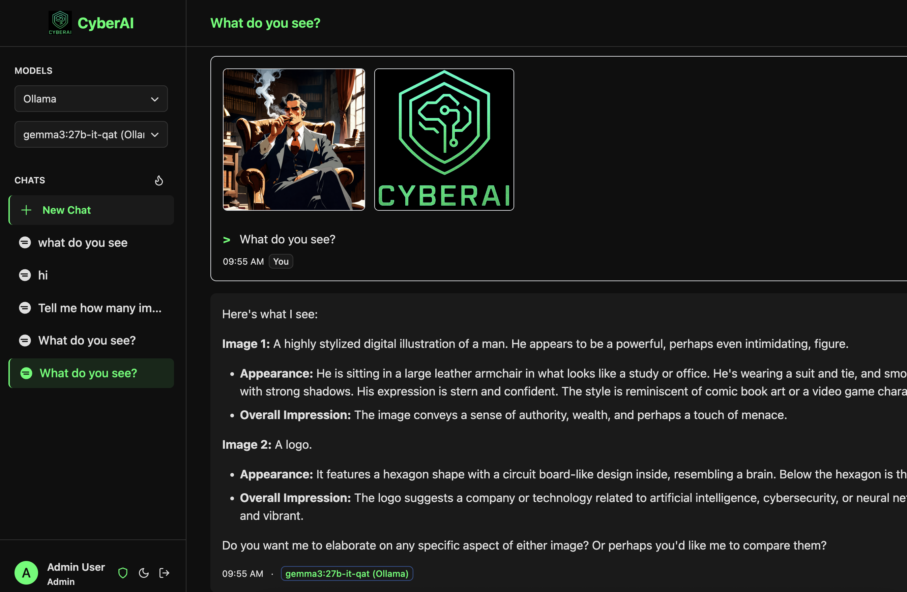
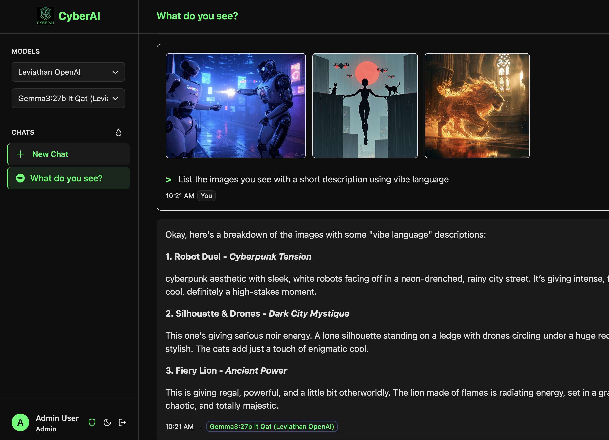
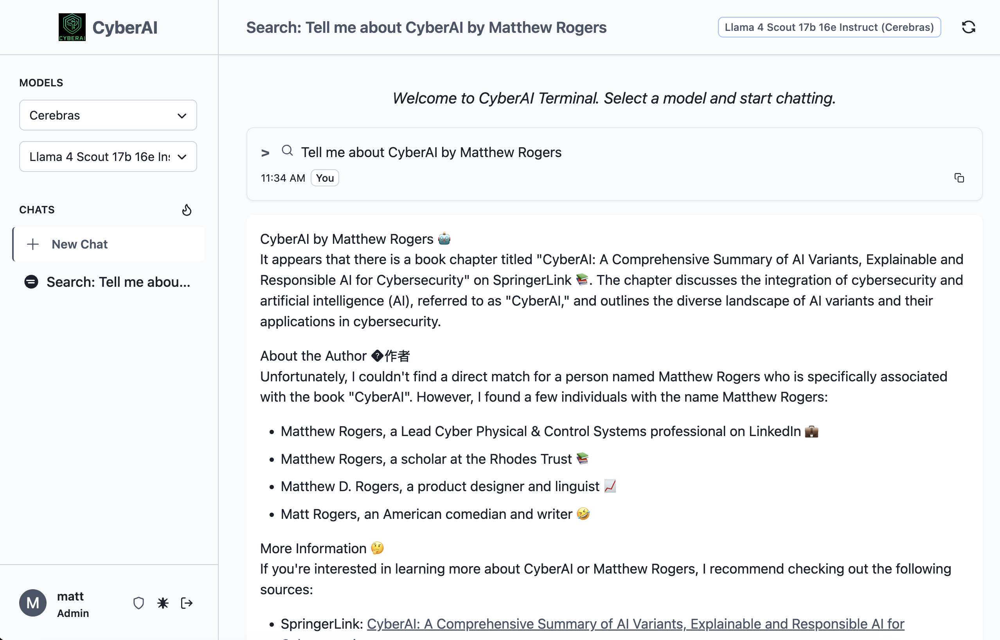
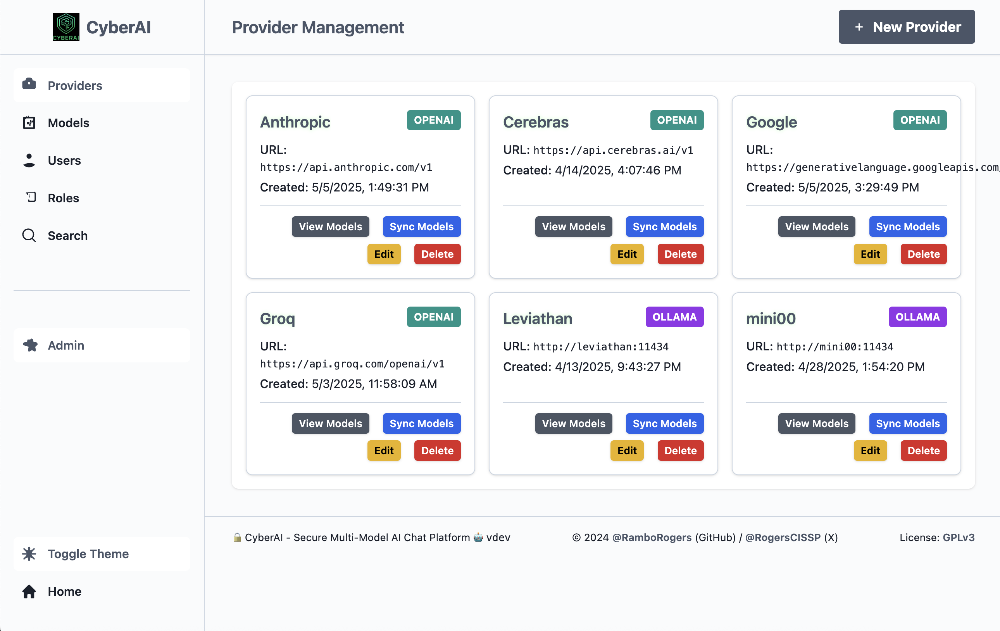

<div align="center">
<table>
  <tr>
    <td colspan="2">
      <h2>🎯 Version 0.3.0: Multi-Modal AI Support</h2>
      <p><strong>Now with Image Upload & Vision Model Integration</strong></p>
    </td>
  </tr>
  <tr>
    <td>
      
    </td>
    <td>
      
    </td>
  </tr>
  <tr>
    <td>
      
    </td>
    <td>
      
    </td>
  </tr>
  <tr>
    <td>
      
    </td>
    <td>
      
    </td>
  </tr>
</table>
<p><em>Note: Screenshots may not reflect the latest UI/UX rework. It's probably cooler than this.</em></p>
</div>

<div align="center">
  <h1>CyberAI</h1>
  <p><strong>Secure Multi-Modal AI Chat Platform</strong></p>
  <p>🤖 Multiple AI Models | 🖼️ Image Upload & Vision | 🌍 Web UI | ⚡ Real-time Streaming | 🔒 Secure | 🎨 Cyberpunk Terminal</p>
  <p>
    
    
    
    
  </p>
</div>

[Link to Video](https://x.com/rogerscissp/status/1917092440068047334)

CyberAI is a powerful, secure multi-user chat platform that integrates multiple AI models through a cyberpunk-inspired terminal interface. Built with performance, security, and flexibility in mind, it provides a centralized interface for interacting with various language models, leveraging Retrieval-Augmented Generation (RAG) with web search and chat history to deliver more informed and contextually relevant responses.

**NEW in 0.3.0:** Full multi-modal support with image upload capabilities - drag & drop images, paste from clipboard, or use the file picker to enhance your conversations with AI vision models like GPT-4V and Ollama's LLaVA models.

**Features dual theme modes:** Switch between the signature cyberpunk "Hacker" theme and a professional "Business" theme for corporate environments, with automatic browser dark/light mode detection.

> The intention is to provide a sleek, secure, and efficient way to interact with AI language models through a unified interface.

## 🌟 Features

<table>
  <tr>
    <th>Model Support</th>
    <th>Chat Features</th>
  </tr>
  <tr>
    <td>
      <ul>
        <li>Multiple LLM provider integration (Ollama, OpenAI)</li>
        <li>Multi-modal vision model support (GPT-4V, LLaVA, etc.)</li>
        <li>Custom agent system with specialized prompts</li>
        <li>Model enumeration system</li>
        <li>Per-user model access control</li>
        <li>Endpoint registration system</li>
        <li>Model discovery system</li>
      </ul>
    </td>
    <td>
      <ul>
        <li>Image upload via drag & drop, file picker, or clipboard paste</li>
        <li>Multi-image attachment support (up to 5 images per message)</li>
        <li>Image preview and management in chat interface</li>
        <li>Automatic image cleanup on chat deletion</li>
        <li>Real-time message streaming</li>
        <li>Markdown rendering for responses</li>
        <li>Copy-to-clipboard functionality</li>
        <li>Chat history preservation</li>
        <li>Multi-user concurrent chat sessions</li>
        <li>Smooth scrolling interface</li>
        <li>Retrieval-Augmented Generation (RAG) using web search results and conversation history for enhanced context and accuracy.</li>
        <li>Integrated web search (Brave Search, Google CSE) to feed real-time data into RAG.</li>
      </ul>
    </td>
  </tr>
  <tr>
    <th>User Interface</th>
    <th>Security</th>
  </tr>
  <tr>
    <td>
      <ul>
        <li>Modern, responsive UI built with Tailwind CSS</li>
        <li>Dual theme system: Cyberpunk "Hacker" theme and professional "Business" theme</li>
        <li>Automatic browser dark/light mode detection with manual override</li>
        <li>Cyberpunk S3270 terminal-inspired design (Penguin UI theme)</li>
        <li>Unified style across Chat and Admin interfaces</li>
        <li>Dynamic model selection dropdowns</li>
        <li>Image attachment interface with visual feedback</li>
        <li>Admin dashboard for system management</li>
        <li>Agent creation/selection UI (Planned/Not Implemented)</li>
        <li>Metrics display component (Planned/Not Implemented)</li>
      </ul>
    </td>
    <td>
      <ul>
        <li>User authentication system</li>
        <li>Role-based access control</li>
        <li>Secure file upload with validation</li>
        <li>Image storage with user isolation</li>
        <li>Secure API endpoint storage</li>
        <li>Protected WebSocket connections</li>
        <li>Input sanitization</li>
        <li>Encrypted sensitive data</li>
      </ul>
    </td>
  </tr>
</table>

## Updates

- 0.3.0 Multi-Modal Support Release
  - Image upload support via drag & drop, file picker, and clipboard paste
  - Integration with OpenAI vision models (GPT-4V, GPT-4-vision-preview)
  - Support for Ollama vision models (LLaVA, Llama-Vision, etc.)
  - Smart image cleanup on chat deletion
  - Enhanced chat interface with image preview and management
  - Secure image storage with user isolation

- 0.2.0 First Tagged Release
  - White mode/business theme added.
  - Fixed a new chat bug where you would be driven back to a previous chat session.
  - Fixed a JS session bug where lots of logs were generated.

## Todo 📋

- [ ] Gated User Profile (Can only access Persona's)
- [ ] Agents for Users (Persona's with special prompts!)
- [ ] Agents with Tools (can do work)
- [x] Search (Brave API and Google API)

## 🚀 Quick Start

You can run CyberAI using Docker with either `docker run` or `docker-compose`.

**Default credentials:**
- Username: `admin`
- Password: `admin`

### Option 1: Docker Run

This command uses a Docker named volume (`cyberai-data`) to store the application's data (like the SQLite database) persistently.

```bash
docker run -d --name cyberai \
  -p 8080:8080 \
  -v cyberai-data:/cyberai/data \
  mattrogers/cyberai:latest
```

**Upgrade:**

```bash
docker pull mattrogers/cyberai:latest
docker stop cyberai && docker rm cyberai
docker run -d --name cyberai \
  -p 8080:8080 \
  -v cyberai-data:/cyberai/data \
  mattrogers/cyberai:latest
```

*   `-d`: Run in detached mode.
*   `--name cyberai`: Assign a name to the container.
*   `-p 8080:8080`: Map host port 8080 to container port 8080.
*   `-v cyberai-data:/cyberai/data`: Mount the named volume `cyberai-data` to the `/cyberai/data` directory inside the container.

### Option 2: Docker Compose

1.  Create a `docker-compose.yml` file with the following content:
    ```yaml
    version: '3.8'

    services:
      cyberai:
        image: ramborogers/cyberai:latest
        container_name: cyberai
        ports:
          - "8080:8080"
        volumes:
          - cyberai-data:/cyberai/data
        restart: unless-stopped

    volumes:
      cyberai-data:
    ```
2.  Run the following command in the same directory as the `docker-compose.yml` file:
    ```bash
    docker-compose up -d
    ```
    This will automatically create the named volume `cyberai-data` if it doesn't exist.

### Accessing the Web Interface

Once the container is running (using either method), access the web interface at:
- Web UI: http://localhost:8080

### Upgrading the Docker Container

**Using Docker Run:**

1.  Pull the latest image: `docker pull mattrogers/cyberai:latest`
2.  Stop and remove the existing container: `docker stop cyberai && docker rm cyberai`
3.  Start the new container using the *same* volume mount command as above.

**Using Docker Compose:**

1.  Pull the latest image: `docker-compose pull`
2.  Restart the service, which will automatically use the new image and the existing volume: `docker-compose up -d`

## 🔨 Building from Source

### Prerequisites

- Go 1.21 or later

### Clone and Build

```bash
# Clone the repository
git clone https://github.com/ramborogers/cyberai.git
cd cyberai

# Build the application
go build -o cyberai ./cmd/cyberai

# Run the application (creates data/cyberai.db by default)
./cyberai
```

### Run without Building

```bash
# Run directly with Go
go run ./cmd/cyberai
```

### Environment Variables

CyberAI uses environment variables for configuration (no config file needed):

| Variable | Description | Default |
|----------|-------------|---------|
| PORT | Web server port | 8080 |
| SESSION_KEY | Secret key for session cookies | Default insecure key (only for development) |
| DB_PATH | SQLite database file path | `/cyberai/data/cyberai.db` (Docker) or `data/cyberai.db` (local) |

Example usage when running locally:

```bash
# Set environment variables
export PORT=9090
export SESSION_KEY="your-secure-session-key"
export DB_PATH="/path/to/database.db"

# Run the application
./cyberai
```

## 💻 Usage

CyberAI provides a unified interface for interacting with various AI models:

1. **Login** with your credentials
2. **Select** your preferred AI model
3. **Chat** in real-time with streaming responses
4. **Create** custom agents with specialized system prompts
5. **Search** the web directly from your chat with integrated search providers

### Admin Features

```bash
# Access admin dashboard
http://localhost:8080/admin

# Add new API endpoints
# Manage user permissions
# Create specialized agents
# Configure search providers (Brave Search, Google CSE)
# View system metrics
```

## 🔍 Technical Architecture

### Backend (Go)
- Modular server structure to handle multiple LLM API integrations
- User authentication and session management
- WebSocket handlers for real-time chat updates
- Admin API for managing system resources
- Search provider integration for web search capabilities

### Frontend
- Responsive chat interface with S3270 terminal-inspired design
- Dynamic model selection and agent management
- Admin dashboard for system configuration

### Database

Stored under /data/cyberai.db
- User credentials and permissions storage
- Chat history preservation
- Configuration management
- Search provider settings

### Image Storage

Stored under /data/images/
- Image storage with user isolation
- Image preview and management in chat interface
- Automatic image cleanup on chat deletion


## ⚖️ License

<p>
CyberAI is licensed under the GNU General Public License v3.0 (GPLv3).<br>
<em>Free Software</em>
</p>

[](https://www.gnu.org/licenses/gpl-3.0)

### Connect With Me 🤝

[](https://github.com/RamboRogers)
[](https://x.com/rogerscissp)
[](https://matthewrogers.org)

</div>
